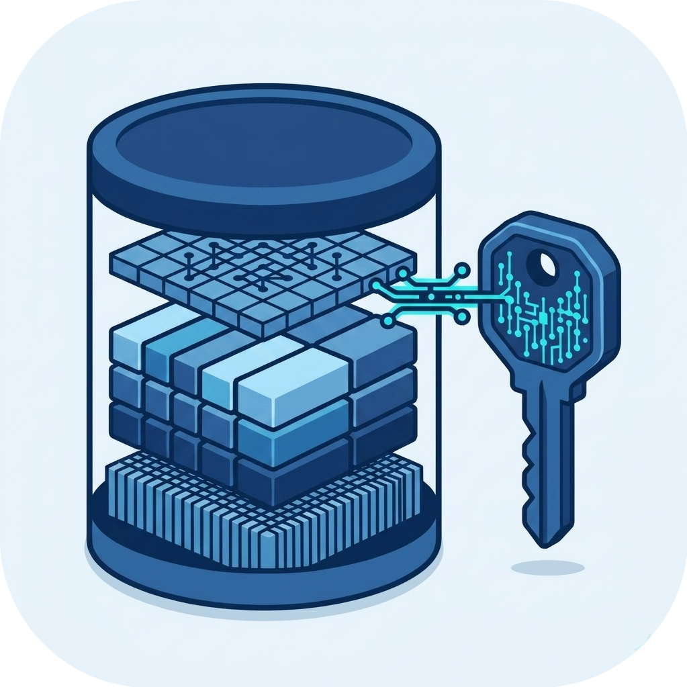

<div align="center">
  
  <span style="font-family: 'Mona Sans', sans-serif; font-size: 6em; font-weight: 800; margin-bottom: 0;vertical-align: middle;">getme</span>
  <div style="margin-top: 10px;"><strong>Core Engine Container for a High-Performance Key-Value Store</strong></div>
</div>

<!-- --- -->

## 📑 Index

- [Overview](#-overview)
- [Image Architecture](#-image-architecture)
- [Quick Start](#-quick-start)
- [Volumes and Persistence](#-volumes-and-persistence)
- [Security & Customization](#-security--customization)
- [Links](#-links)

<!-- --- -->

## 📖 Overview

`getme` is a persistent, embeddable, log-structured key-value store optimized for high write throughput and low-latency reads. 

This specific Docker image (`getme-core`) runs **only** the core storage engine. It is designed for maximum performance and minimal footprint, communicating exclusively over Unix Domain Sockets (UDS) rather than standard HTTP.

If you need the HTTP proxy and built-in CLI, please use our All-in-One image instead.

<!-- --- -->

## 🏗 Image Architecture

This image is built using a highly optimized multi-stage Docker build process defined in `ContainerFile.server`:

1. **Build Stage (`golang:1.23.1-alpine`)**: Compiles the core engine from source, including only the `server`, `utils`, and `commons` modules.
2. **Final Stage (`alpine:latest`)**: The statically linked `getMe` binary is copied into a clean, minimal Alpine Linux base image. This keeps the final image size incredibly small and reduces the attack surface. No other tools or proxies are included.

<!-- --- -->

## 🚀 Quick Start

Because this container communicates via a Unix Domain Socket, you **must** bind-mount the socket directory so that external applications (like your app using one of our SDKs) can connect to the database.

```bash
docker run -d \
  --name getme-engine \
  -v getme_data:/var/lib/getMeStore \
  -v /tmp/getMeStore/sockDir:/tmp/getMeStore/sockDir \
  your-dockerhub-username/getme-core:latest
```

**Crucial:** The `-v /tmp/getMeStore/sockDir:/tmp/getMeStore/sockDir` mapping allows the internal `getMe.sock` file created by the engine to be accessible by other processes running on the host machine.

<!-- --- -->

## 💾 Volumes and Persistence

To ensure your data survives container restarts and that communication flows properly, mount volumes to the following directories inside the container:

- `/var/lib/getMeStore/dataDir`: The primary directory where the log-structured segments (database files) are stored.
- `/tmp/getMeStore/sockDir`: **Required** for external Unix Domain Socket communication.
- `/tmp/getMeStore/dumpDir`: Used by the internal application logger.

<!-- --- -->

## 🛡️ Security & Customization

Security is built-in by design. The container **does not run as root**.

During the build process, an unprivileged user named `appuser` (along with `appgroup`) is created. The binary executes under this user profile, and the ownership of all critical data directories is automatically assigned to `appuser:appgroup`.

You can override the default UID and GID during the build phase using `build-args` if your environment requires specific user ID mappings to avoid local permission conflicts:

```bash
docker build --build-arg UID=2000 --build-arg GID=2000 -t getme-core -f ContainerFile.server .
```

<!-- --- -->

## 🔗 Links

- **GitHub Repository**: [**Visit here!**](https://github.com/AatirNadim/getMe)
- **Blog Part I - Building getme**: [**Read here!**](https://techtom.hashnode.dev/building-getme-i)
- **Blog Part II - Building getme**: [**Read here!**](https://techtom.hashnode.dev/building-getme-ii)
- **SDKs Available**: Go, Java, JavaScript, Python