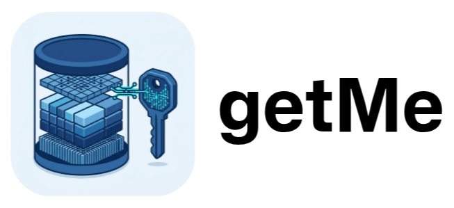

<div align="center">
  
  
</div>

> **getme-landing** is the official landing page for the high-performance, local-first Key-Value Store, **getMe**.

## 📑 Index

- [Overview](#overview)
- [Features](#features)
- [Tech Stack](#tech-stack)
- [Project Structure](#project-structure)
- [Key Components](#key-components)
- [Getting Started](#getting-started)
- [Available Scripts](#available-scripts)

---

## <a id="overview"></a>📖 Overview

The `getme-landing` project is a modern, fast, and responsive Next.js application that serves as the marketing and documentation entry point for the **getMe** KV store. 

`getMe` itself is a persistent, embeddable key-value store written in Go, inspired by Bitcask, and optimized for high write throughput and low-latency reads. This landing page showcases its core capabilities, including its architecture, performance metrics, MCP server integration, and usage examples.

## <a id="features"></a>✨ Features

- **Smooth Scrolling & Parallax:** Fluid navigation powered by Lenis and GSAP.
- **Dark Mode Support:** Seamless theme switching with `next-themes`.
- **Interactive Architecture Diagrams:** Animated visualizations of the log-structured hash table and internal components.
- **Code Snippets & Examples:** Highlighting simple SDK integrations across multiple languages.
- **Terminal UI Simulation:** A visual CLI experience on the web.

## <a id="tech-stack"></a>🛠 Tech Stack

The project leverages cutting-edge web technologies to deliver a smooth and engaging user experience:

- **Framework:** [Next.js 16](https://nextjs.org/) (App Router)
- **Library:** [React 19](https://react.dev/)
- **Styling:** [Tailwind CSS v4](https://tailwindcss.com/)
- **Animations:** [GSAP](https://gsap.com/) & [Lenis](https://lenis.studiofreight.com/)
- **UI Components:** [Radix UI](https://www.radix-ui.com/) & [shadcn/ui](https://ui.shadcn.com/)
- **Icons:** [Lucide React](https://lucide.dev/)

## <a id="project-structure"></a>📂 Project Structure

```text
getme-landing/
├── app/               # Next.js App Router root (Pages, Layout, Globals)
├── components/        # Reusable UI components & Page sections
│   ├── icons/         # SVG Icon components
│   ├── lightswind/    # Custom light/dark mode components
│   ├── ui/            # Base shadcn/ui components
│   └── ...            # Core page sections (Hero, Architecture, etc.)
├── hooks/             # Custom React hooks (use-mobile, use-toast)
├── lib/               # Utility functions (Tailwind merge, etc.)
├── public/            # Static assets (images, SVGs)
└── package.json       # Project dependencies and scripts
```

## <a id="key-components"></a>🧩 Key Components

The landing page is composed of several interactive and animated sections located in the `components/` directory:

- **`Hero.tsx`**: The main landing section with a one-click install command copy feature.
- **`Architecture.tsx`**: Visual representation of the `getMe` system architecture using GSAP scroll triggers.
- **`Performance.tsx`**: Highlights the high-throughput, low-latency metrics of the KV store.
- **`McpServer.tsx`**: Showcases the Model Context Protocol (MCP) server integration.
- **`Availability.tsx`**: Highlights data safety and reliability features.
- **`UseCases.tsx` / `Examples.tsx`**: Demonstrates practical applications and code examples.
- **`SmoothScroll.tsx`**: Implements fluid scrolling across the entire page using Lenis.
- **`AntigravityBackground.tsx`**: A custom, engaging background effect.

## <a id="getting-started"></a>🚀 Getting Started

Follow these steps to run the landing page locally.

### Prerequisites

- Node.js (v20 or higher)
- npm, yarn, pnpm, or bun

### Installation

1. Clone the repository and navigate to the project directory:
   ```bash
   git clone https://github.com/AatirNadim/getMe.git
   cd getMe/getme-landing
   ```

2. Install dependencies:
   ```bash
   pnpm install
   # or npm install / yarn install / bun install
   ```

3. Start the development server:
   ```bash
   pnpm dev
   ```

4. Open [http://localhost:3001](http://localhost:3001) with your browser to see the result. The development server runs on port **3001** by default.

## <a id="available-scripts"></a>📜 Available Scripts

In the project directory, you can run:

- `pnpm dev` - Runs the app in development mode on port 3001.
- `pnpm build` - Builds the app for production to the `.next` folder.
- `pnpm start` - Starts the production server on port 3001.
- `pnpm lint` - Runs ESLint to catch and fix potential issues.
