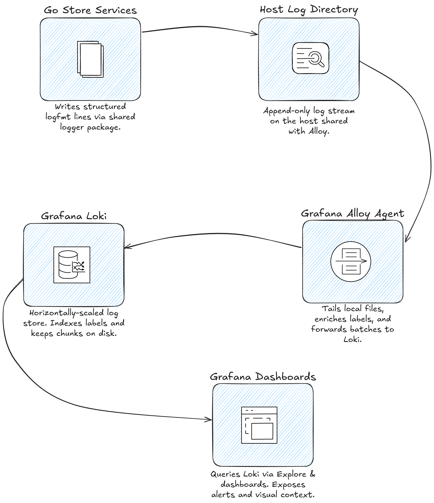

# getMe Logging Infrastructure

This article outlines the architecture and components of the logging infrastructure for the `getMe` key-value store. The stack is designed for local development and provides log collection, aggregation, storage, and visualization using Grafana Alloy, Grafana Loki, and Grafana.

The entire stack is orchestrated using Docker Compose, as defined in [docker-compose.logging.yml](./docker-compose.logging.yml).

## Architecture Flow

The logging pipeline is a sequence of steps that takes a log message from its origin in the application to its final visualization in a Grafana dashboard.

1. **Log Generation**: The `getMe` application uses a custom logger (`/server/utils/logger/logger.go`) to write log entries to files on the host machine. Logs are written in `logfmt` format to `/tmp/getMeStore/dumpDir/`. This logger can be disabled programmatically, which is useful for scenarios like benchmarking where logging overhead is undesirable.

2. **Log Collection (Grafana Alloy)**: The `grafana-alloy` container runs Grafana's agent. It mounts the host's log directory (`/tmp/getMeStore/dumpDir`) as a read-only volume. Its configuration (`alloy/config.alloy`) instructs it to:
    * Discover and tail all `.log` files in the mounted directory.
    * Parse each log line using a `logfmt` processor.
    * Extract key-value pairs like `level`, `msg`, and `timeStamp`.
    * Create a `level` label from the corresponding log field to enable efficient filtering in Loki.
    * Set the log's timestamp from the `timeStamp` field.
    * Forward the processed log entry to the Loki service.

3. **Log Aggregation & Storage (Grafana Loki)**: The `grafana-loki` container receives log streams from Alloy. Loki is a horizontally scalable, multi-tenant log aggregation system inspired by Prometheus.
    * It indexes the metadata (labels like `level`, `job`, `environment`) but not the full log content. This makes it highly efficient for storage and querying.
    * Log data is persisted to the host machine via a named Docker volume (`loki-storage`), ensuring that logs survive container restarts.
    * The default retention period is set to 24 hours as per `loki/config.yml`.

4. **Log Visualization (Grafana)**: The `grafana` container provides a web UI for querying and visualizing the logs stored in Loki.
    * It is pre-configured via provisioning (`grafana/provisioning/datasources/loki.yml`) to automatically connect to Loki as a data source.
    * Users can access Grafana at `http://localhost:3000` (default credentials: `admin`/`admin`).
    * In the "Explore" view, you can use LogQL (Loki's query language) to search and filter logs. For example, `{job="getMe-app", level="ERROR"}` will show all error-level logs from the application.
    * Grafana's configuration and dashboards are also persisted in a named volume (`grafana-storage`).

## Components & Configuration

### 1. `grafana-alloy`

- **Image**: `grafana/alloy:v1.11.2`
- **Role**: Log collector and forwarder.
- **Configuration**: `/alloy/config.alloy`
  - `local.file_match`: Defines the target log files to monitor.
  - `loki.process`: Sets up the parsing and labeling pipeline.
  - `loki.write`: Configures the destination endpoint (Loki).
- **Key Detail**: It bridges the gap between the application's log files and the central Loki instance.

### 2. `grafana-loki`


- **Image**: `grafana/loki:3.4.2`
- **Role**: Central log storage and query engine.
- **Configuration**: `/loki/config.yml`
  - `storage`: Configured to use the filesystem, with data stored in the `loki-storage` volume.
  - `schema_config`: Uses the `tsdb` index store, which is recommended for performance.
    -   `limits_config`: Defines a `retention_period` of `24h`.
-   **Persistence**: Data is stored in the `loki-storage` Docker volume.

### 3. `grafana`

- **Image**: `grafana/grafana:11.0.0`
- **Role**: UI for querying and visualizing logs.
- **Configuration**:
  - The Loki data source is provisioned via `/grafana/provisioning/datasources/loki.yml`.
  - Environment variables are used to set the admin password and enable anonymous viewer access.
- **Persistence**: Dashboards and settings are stored in the `grafana-storage` Docker volume.

## How to Run

To keep everything in sync, go the root of the server directory and start the ***entire application with the logging stack included***:

```bash
cd ../.. # go to the server
./init-server-local.sh

```

## Logging Flow Diagram


